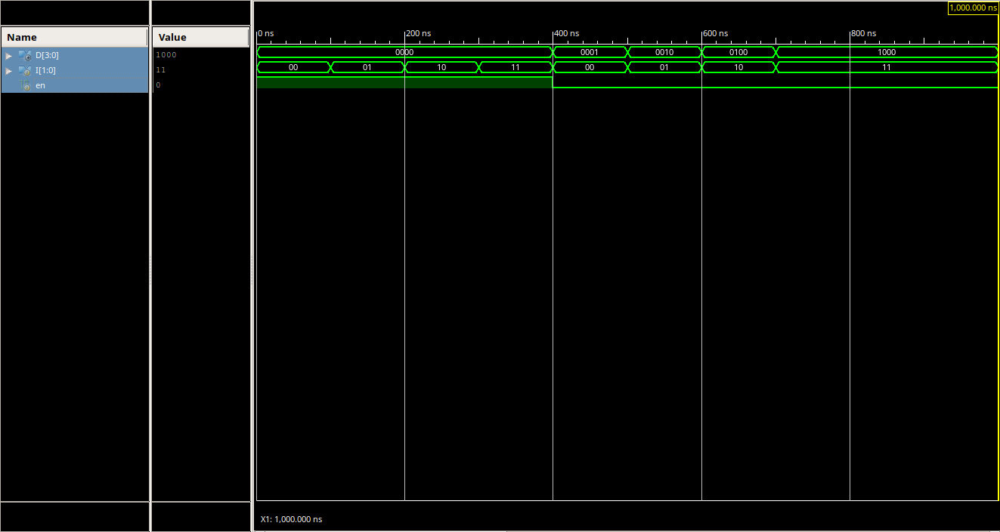
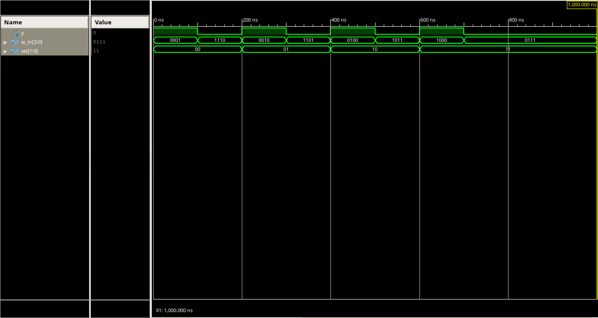
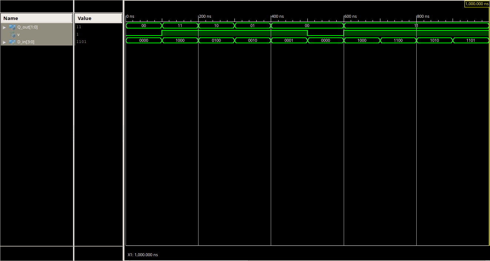
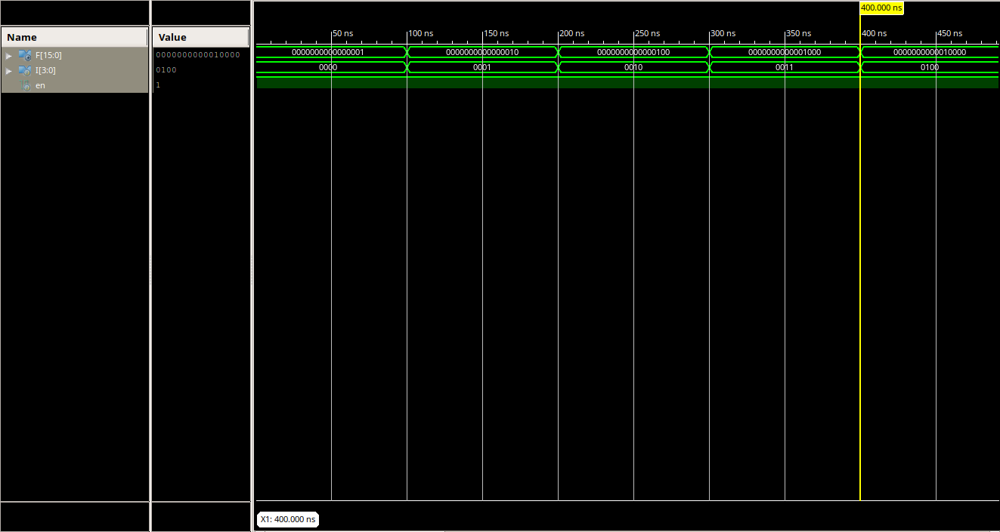
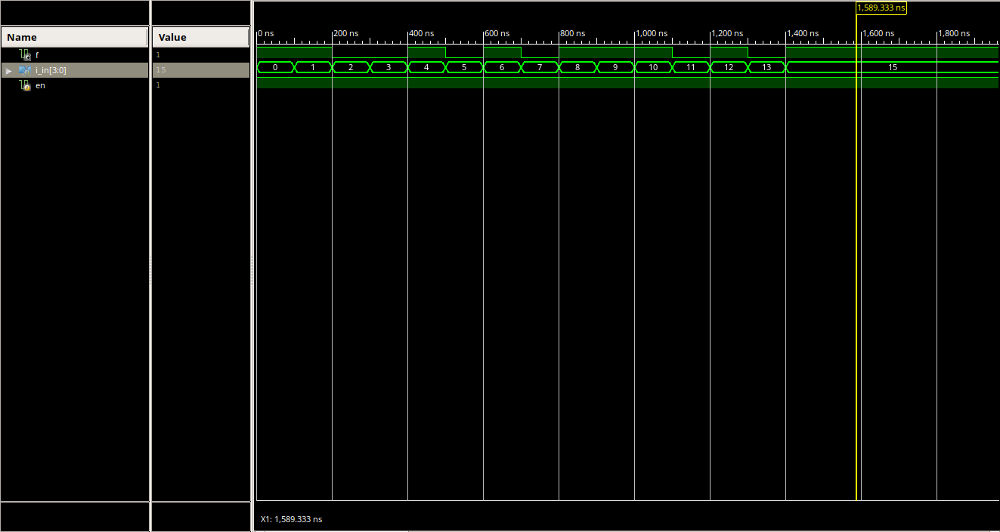

### Goals

- How describle Encoder, Decoder, Multiplexer?
- Implementing parity bit generator 
- Modular implementation in Verilog
- How write Testbench?

### Pre-Report
* Write verilog code for decoder 2x4, encoder 4x2 and multiplexer 4x1 in gate level.

**Note**
* [1]. For design in gate level you can use `and`, `nand`, `or`, `nor`, `xor`, `xnor`, `not` **primitives** (i.e. `not g_not(a, b)`).
* [2]. For design in gate level you can use **assign** keyword (i.e `assign a = ~b`).

### Grading Sources

* Write verilog code for encoder, decoder, and multiplexer of pre-report section (`decoder2x4.v`, `pEncoder4x2.v`, and `mux4x1.v`).

* Simulate encoder, decoder, and multiplexer verilog files in ISim. You can use included testbench files.

* Design 4X16 Decoder using 2X4 Decoder and write verilog code of it (`decoder4x16.v`).

* Design prime number detector by implementing **f(a,b,c,d) = &#928;(0,1,4,6,8,9,10,12,14,15)** using decoder 4x16 (`function_with_dec4x16.v`). and find testbeanch of it here (`tb_function_with_dec4x16.v`)

### Results
- Decoder2x4

- Mux4x1

- Priority Encoder4x2

- Decoder4x16

- POS function with 4x16 decoder

