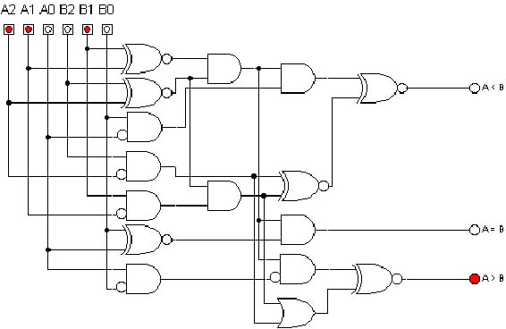
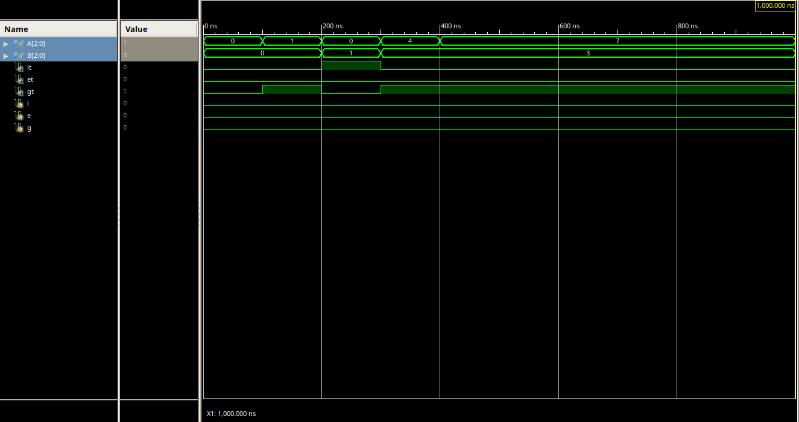

### Goals

- How describle comparator in gate level?
- Structural implementation in Verilog

### Pre-Report
* Write verilog code for 3 bits comparator in gate level.

I Write code for this design:

### Grading Sources

* Write verilog code for 3 bits comparator of pre-report section (`comp3.v`).
* Simulate 3 bits comparator in Xilinx ISim. You can use included testbench files. (`tb_comp3`)

### Results

