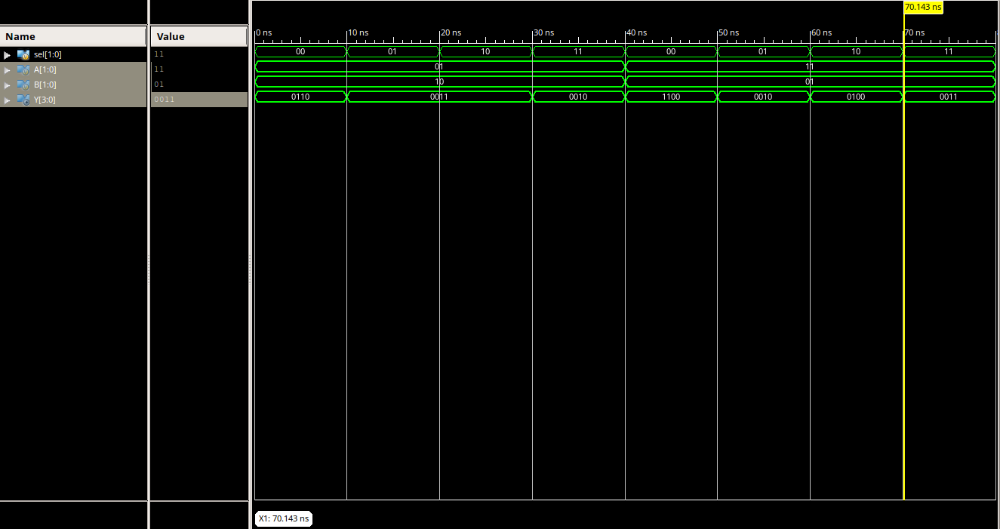

### Goals

- How describle arithmetic logic unit 
- How design bus using multiplexer
- Structural implementation in Verilog

### Pre-Report
* Write verilog code for 4bit 4 to 1 multiplexer.
* Write verilog code for arithmetic logic unit usign multiplexer and `assign` keyword.

| Operation | Description | Sel[1] | Sel[0] |
|-----------|-------------|--------|--------| 
|    NOT    |      A'     |    0   |    0   |
|    NAND   |   (A & B)'  |    0   |    1   |
|    ADD    |    A + B    |    1   |    0   |
|  MULTIPLY |    A * B    |    1   |    1   |

### Grading Sources

* Write verilog code for 4bit 4 to 1 multiplexer of pre-report section (`multiplexer4x4.v`).
* Write verilog code for arithmetic logic unit of pre-report section (`alu.v`).
* Write testbench file of alu for validate the correctness of alu by all possible states (`tb_alu.v`).

### Result

